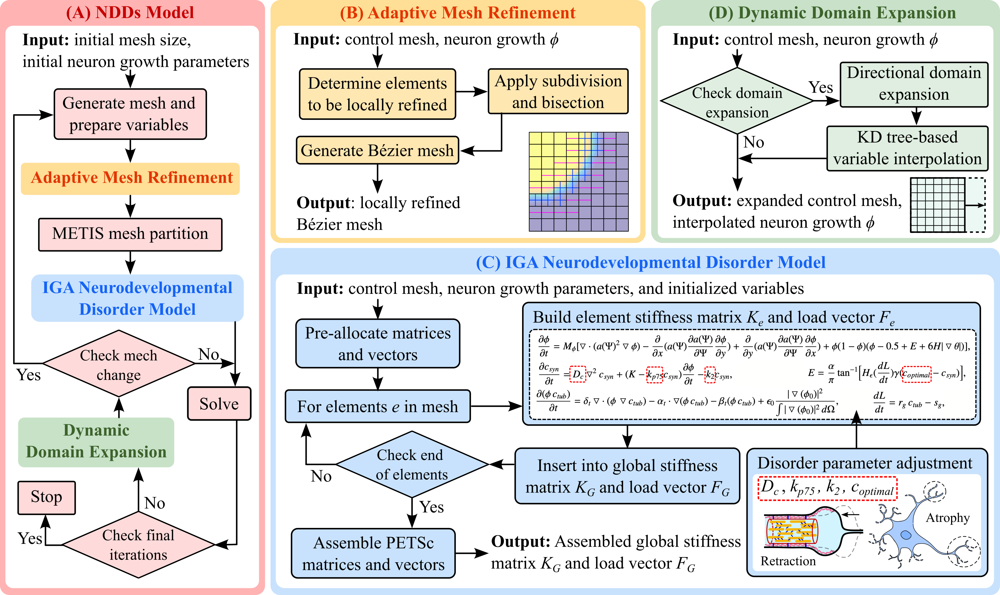

# Neurodevelopmental Disorder (NDD) Model
Neurodevelopmental disorders modeling using innovative isogeometric analysis, dynamic domain expansion and local refinement

### Flow chart of the NDDs modeling pipeline

## User Guide
This code is the implementation of the phase field model using isogeometric analysis to simulate neurodevelopmental disorders.
Based on truncated T-spline with local refinements and dynamic domain expansion, the implementation uses PETSc library for MPI parallelization.

## File structures
- **[2D_solver_coarse](https://github.com/CMU-CBML/NNDs/tree/main/2D_solver_coarse)**: contains code for 2D Phase field model for NDDs using isogeometric method.
- **[2D_solver_coarse_compCase](https://github.com/CMU-CBML/NNDs/tree/main/2D_solver_coarse_compCase)**: code modified for comparison cases in paper.
- **[2D_solver_compareMatlab](https://github.com/CMU-CBML/NNDs/tree/main/2D_solver_compareMatlab)**: code modified for comparison with previous Matlab code.
- **[2D_solver_compareMatlab_AxonDiff](https://github.com/CMU-CBML/NNDs/tree/main/2D_solver_compareMatlab_AxonDiff)**: code modified for axon differentiation test.
- **[THS2D](https://github.com/CMU-CBML/NNDs/tree/main/THS2D)**: truncated T-spline code by Xiaodong Wei.
- **[eigen-3.4.0](https://github.com/CMU-CBML/NNDs/tree/main/eigen-3.4.0)**: eigen-3.4.0 library for ease of use.
- **[genBatch](https://github.com/CMU-CBML/NNDs/tree/main/genBatch)**: batch script generation for PSC HPC system
- **[nanoflann/1.5.5](https://github.com/CMU-CBML/NNDs/tree/main/nanoflann/1.5.5)**: nanoflann/1.5.5 library for ease of use.
- **[spline2D_src](https://github.com/CMU-CBML/NNDs/tree/main/spline2D_src)**: 2D spline generation code for initialization by Angran Li

## How to run (Assuming Linux environment)
1. Installation of **[PETSc](https://petsc.org/release/install/)** (and its dependents), METIS, gcc, g++, gfortran, make.
2. Make and build THS2D, spline2D_src, and 2D_solver_XXXX that you want to run
    * make clean
    * make all
3. [petsc mpirun path] -n [number of threads] ./2DNG [number of neurons] [number of iterations] [input/output path] | tee -a [log file path]
    * example:
        ` /.../petsc/arch-linux-c-opt/bin/mpirun -n 32 ./2DNG 1 350000 ../io2D/ | tee -a ../io2D/log.txt`
    * for comparison cases, replace number of neurons with case ID:
        ` /.../petsc/arch-linux-c-opt/bin/mpirun -n 32 ./2DNG K 350000 ../io2D/ | tee -a ../io2D/log.txt`

## Reference
1. K. Qian, G. O. Suarez, T. Nambara, T. Kanekiyo, V. A. Webster-Wood, Y. J. Zhang. Neurodevelopmental disorders modeling using innovative isogeometric analysis, dynamic domain expansion and local refinement. In preparation.
2. K. Qian, A. Liao, S. Gu, V. Webster-Wood, Y. J. Zhang. **[Biomimetic IGA Neuron Growth Modeling with Neurite Morphometric Features and CNN-Based Prediction](https://www.sciencedirect.com/science/article/pii/S0045782523003377)**, Computer Methods in Applied Mechanics and Engineering, 116213, 2023.
3. A. S. Liao, W. Cui, Y. J. Zhang, V. A. Webster-Wood, **[Semi-automated quantitative evaluation of neuron developmental morphology in vitro using the change-point test](https://pubmed.ncbi.nlm.nih.gov/36070028/)**, Neuroinformatics 21:163–176, 2022.
4. K. Qian, A. Pawar, A. Liao, C. Anitescu, V. Webster-Wood, A. W. Feinberg, T. Rabczuk, Y. J. Zhang, **[Modeling neuron growth using isogeometric collocation based phase field method](https://www.nature.com/articles/s41598-022-12073-z)**, Scientific Reports 12:8120, 2020.
5. X. Wei, Y. J. Zhang, T. J. R. Hughes. **[Truncated T-splines: Fundamentals and methods](https://www.sciencedirect.com/science/article/abs/pii/S004578251630771X)**, Computer Methods in Applied Mechanics and Engineering, 316:349-372, 2017.
